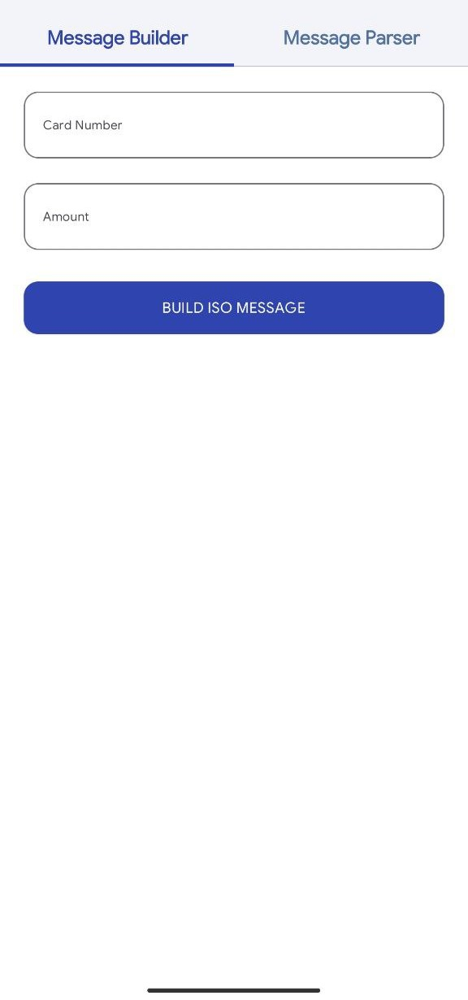
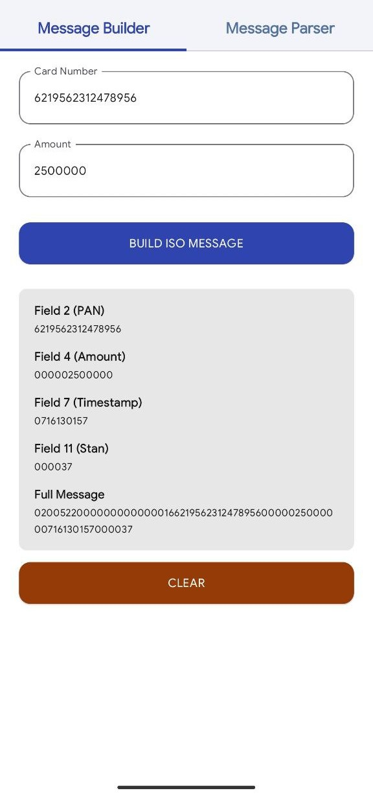
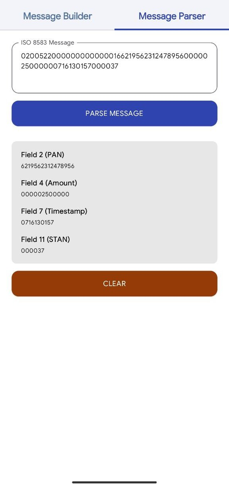

# ISO 8583 Lab

A demo project for **building and parsing ISO 8583 messages** using **jPOS** and Kotlin/Jetpack Compose.

<div style="display: flex; flex-wrap: wrap; gap: 10px;">

  
  
  
  

</div>

## Features

* Build financial messages with MTI 0200
* Parse incoming ISO 8583 messages
* Incremental STAN management
* Error handling for user inputs and ISO 8583 message packing/unpacking

---

## How to Run

### 1. Clone the repository

```bash
git clone https://github.com/shossein74/ISO8583Lab.git
```

### 2. Install dependencies
Open the project in Android Studio.

Ensure Gradle dependencies are synced:

```gradle
implementation("org.jpos:jpos:2.1.7")
implementation("androidx.datastore:datastore-preferences:1.1.7")
```
Wait until all dependencies are downloaded.

### 3. Run the app
- Connect an Android device or start an emulator.

- Press Run → Run 'app' in Android Studio.

### 4. Using the app
Build Message Tab:

- Enter Card Number (PAN) and Amount.

- Press Build Message to generate a packed ISO 8583 message.

- The message is displayed in a readable format.

Parse Message Tab:

- Enter a packed ISO 8583 message.

- Press Parse Message to extract fields (F2, F4, F7, F11).

- Parsed values appear in the UI

---

## Code Overview

### Building an ISO 8583 Message

```kotlin
val isoMessage = ISOMsg().apply {
    packager = ISO87APackager()
    mti = "0200"
    set(2, cardNumber)
    set(4, amount.padStart(12,'0'))
    set(7, transactionDateTime)
    set(11, stan)
}
val bytes = isoMessage.pack()
```

* Uses **ISO87APackager**.
* **Field 2** → Card PAN
* **Field 4** → Amount (12 digits, zero-padded)
* **Field 7** → Transaction Date (MMDDhhmmss)
* **Field 11** → STAN (Transaction Number)

---

### Parsing an ISO 8583 Message

```kotlin
val isoMessage = ISOMsg().apply {
    packager = ISO87APackager()
    unpack(bytes)
}
val field2 = isoMessage.getString(2)
val field4 = isoMessage.getString(4)
val field7 = isoMessage.getString(7)
val field11 = isoMessage.getString(11)
```

---

## Incremental STAN Logic

The **STAN (System Trace Audit Number)** is a unique 6-digit transaction identifier used in ISO 8583 messages. It is used to track and distinguish each transaction.

**Key points:**

- **6-digit number**: Always formatted with leading zeros (e.g., `000001`, `000002`).
- **Incremental**: After each message build, the STAN increases by 1.
- **Reset**: When it reaches `999999`, it rolls over back to `000001`.
- **Persistence**: The current STAN value is saved in `StanDataStore` so that it is preserved across app sessions and app restarts.

**Example usage:**

```kotlin
val field11 = "%06d".format(Locale.getDefault(), stanCounter)
incrementStan()  // Increase and save next STAN
```

---

## Sample Input / Output

### Form Input

| Field       | Sample Value     |
| ----------- | ---------------- |
| Card Number | 6219562312478956 |
| Amount      | 2500000          |

### Built Message (Packed + Printable)

```
MTI: 0200
F2: 6219562312478956
F4: 000002500000
F7: 0716130157
F11: 000037
Packed message: 020052200000000000001662195623124789560000025000000716130157000037
```

### Parsed Message

e.g. 020052200000000000001662195623124789560000025000000716130157000037

```
MTI: 0200
F2: 6219562312478956
F4: 000002500000
F7: 0716130157
F11: 000037
```

---

## Full ISO 8583 Message Format

* **MTI**: 4 digits → 0200
* **Bitmap**: 8 bytes
* **Field 2 (PAN)**: variable length (up to 19 digits)
* **Field 4 (Amount)**: 12 fixed digits
* **Field 7 (Date/Time)**: 10 digits (MMDDhhmmss)
* **Field 11 (STAN)**: 6 fixed digits

> Other fields are not used in this demo.

